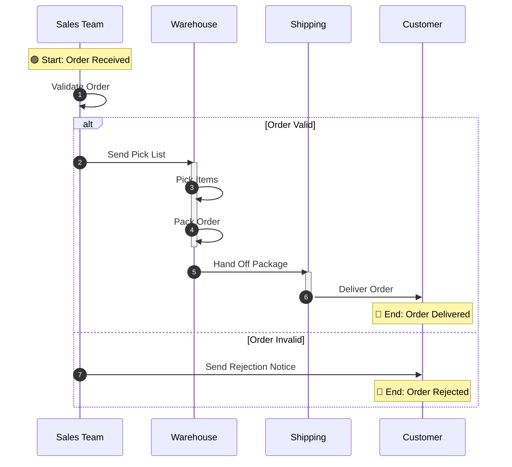

# BPMN-to-Mermaid Sequence Diagram Skill

> **Version**: 1.0.0  
> **Last Updated**: 2026-09-09  
> **Original Author**: Bala Madhusoodhanan  
> **Enhanced By**: Antigravity AI (Peer Coding)  
> **Status**: Production Ready

---

## Overview

This skill converts BPMN process diagrams from **Visio (.vsdx)** or **PDF** files into **Mermaid sequence diagrams**, capturing all participants (users, systems, roles), process steps as messages, and decision trees as `alt`/`else` blocks.

### Development History

This skill was initially drafted by **Bala Madhusoodhanan** as a Visio-to-Mermaid flowchart converter. Through a **peer coding session with Antigravity AI**, the skill was significantly enhanced and refined:

| Aspect | Initial Draft | Antigravity Enhancement |
|--------|--------------|------------------------|
| **Input formats** | `.vsdx` only | Added `.pdf` support with LLM Vision parsing |
| **Output format** | Mermaid flowchart (subgraphs) | Mermaid **sequence diagram** — captures participants, messages, and decision trees |
| **PDF handling** | Not supported | Vision-first approach: PDF → 300 DPI PNG → LLM Vision → structured JSON IR |
| **Architecture** | Single-pass Visio-to-Mermaid | Three-phase pipeline with common JSON Intermediate Representation |
| **Gateway mapping** | Basic shape mapping | Full BPMN-to-sequence mapping: `alt`/`else` for XOR, `par`/`and` for AND, `loop` for cycles |
| **Documentation** | Inline skill instructions | 4 dedicated reference docs + examples + structured prompt templates |
| **Error handling** | Basic | Graceful degradation, fallback strategies, comprehensive troubleshooting table |

### Supported Input Formats

| Format | Extension | Parsing Method |
|--------|-----------|----------------|
| Microsoft Visio | `.vsdx` | Deterministic XML extraction via `vsdx` library |
| PDF (visual BPMN) | `.pdf` | Rendered to PNG → LLM Vision analysis |

### Output Format

Always produces a **Mermaid sequence diagram** including:
- Participants, systems, teams, or roles
- Main activities and message exchanges
- Decision points, exceptions, and alternate paths
- Start-to-end process order

---

## How to Use

### Trigger Instruction

When a user uploads a PDF, VSDX, or VXDX file that contains a business process, workflow, BPMN diagram, or process map, call the skill **"bpmn-to-mermaid-sequence"**.

Use the skill output to create a clear Mermaid **sequence diagram** representing the process flow, including:
- Participants, systems, teams, or roles
- Main activities and message exchanges
- Decision points, exceptions, and alternate paths where identifiable
- Start-to-end process order

Return the result in a Mermaid code block, followed by a short plain-English summary of the sequence.

If the uploaded document does not contain a readable process diagram or sufficient process information, ask the user to upload a clearer version or provide the missing context.

### Quick Start — Visio File

```bash
# Step 1: Parse the Visio file to JSON Intermediate Representation
python scripts/parse_vsdx.py "MyProcess.vsdx" --output parsed.json

# Step 2: Convert JSON IR to Mermaid sequence diagram
python scripts/convert_to_sequence.py parsed.json --output diagram.md
```

### Quick Start — PDF File

```bash
# Step 1: Render PDF pages to high-res PNG images
python scripts/parse_pdf.py "MyProcess.pdf" --output-dir temp_images/

# Step 2: Agent views the PNG images using LLM Vision capabilities
#         and constructs the JSON IR (see references/pdf_vision_guide.md)

# Step 3: Convert JSON IR to Mermaid sequence diagram
python scripts/convert_to_sequence.py parsed.json --output diagram.md
```

---

## File Structure

```
skills-bpnm-seq/
├── README.md                         # This file
├── SKILL.md                          # Skill definition (agent instructions)
├── scripts/
│   ├── utils.py                      # Shared utilities
│   ├── parse_vsdx.py                 # Visio parser → JSON IR
│   ├── parse_pdf.py                  # PDF renderer → PNG + text overlay
│   └── convert_to_sequence.py        # JSON IR → Mermaid sequence diagram
├── references/
│   ├── vsdx_format.md                # VSDX file format reference
│   ├── mermaid_syntax.md             # Mermaid sequence diagram syntax
│   ├── bpmn_to_sequence_mapping.md   # BPMN → Sequence mapping rules
│   └── pdf_vision_guide.md           # LLM Vision PDF parsing guide
└── examples/
    ├── sample_bpmn_input.json        # Example JSON IR (Order-to-Cash)
    └── sample_sequence_output.md     # Expected Mermaid output
```

---

## Architecture

```
 ┌─────────────┐     ┌─────────────┐
 │  .vsdx file │     │  .pdf file  │
 └──────┬──────┘     └──────┬──────┘
        │                   │
        ▼                   ▼
 ┌──────────────┐    ┌──────────────┐
 │ parse_vsdx.py│    │ parse_pdf.py │
 │ (XML extract)│    │ (render PNG) │
 └──────┬───────┘    └──────┬───────┘
        │                   │
        │              ┌────▼─────┐
        │              │LLM Vision│
        │              │ analysis │
        │              └────┬─────┘
        │                   │
        ▼                   ▼
 ┌────────────────────────────────┐
 │    JSON Intermediate Rep (IR)  │
 │  (participants, nodes, edges)  │
 └───────────────┬────────────────┘
                 │
                 ▼
 ┌────────────────────────────────┐
 │    convert_to_sequence.py      │
 │  (graph walk → Mermaid code)   │
 └───────────────┬────────────────┘
                 │
                 ▼
 ┌────────────────────────────────┐
 │  Mermaid Sequence Diagram (.md)│
 └────────────────────────────────┘
```

---

## Prerequisites

- **Python 3.9+**
- **`vsdx`** library — auto-installed on first run (`pip install vsdx`)
- **`PyMuPDF`** — auto-installed on first run (`pip install pymupdf`)
- **LLM Vision capabilities** — for PDF diagram analysis

---

## Example Output



---

## Changelog

| Version | Date | Changes |
|---------|------|---------|
| 1.0.0 | 2026-09-09 | **Antigravity peer coding enhancement** of initial Visio-to-Mermaid draft. Added PDF visual input support (LLM Vision), converted output to sequence diagrams, introduced JSON IR architecture, created 4 reference docs, example files, and comprehensive troubleshooting. |
| 0.1.0 | 2026-09-09 | Initial draft by Bala Madhusoodhanan — Visio (.vsdx) to Mermaid flowchart converter with swimlane/subgraph support. |

---

## License

Internal use only. © 2026
