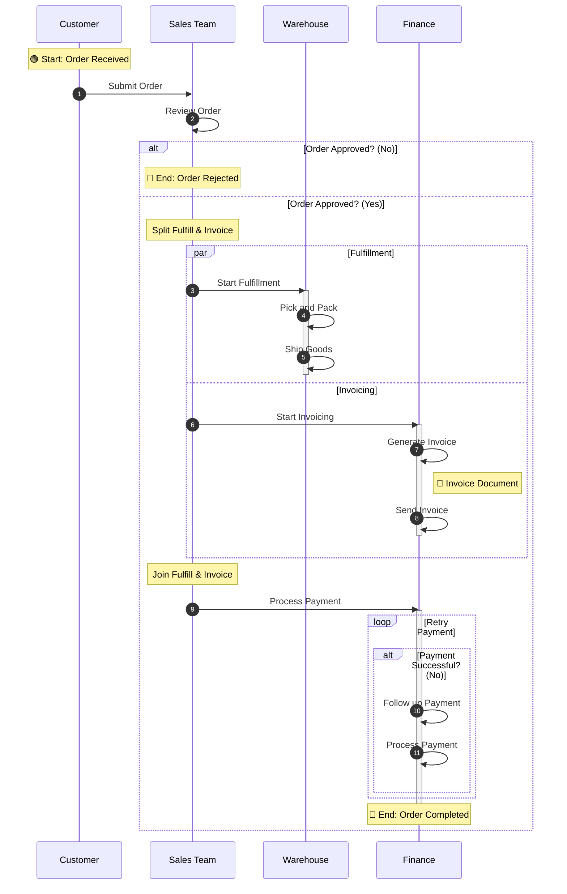

## Order-to-Cash Process

### Mapping Explanations:
- **Pools / Swimlanes**: Represented via sequential `participant` declarations (Customer, Sales Team, Warehouse, Finance).
- **Start / End Events**: Mapped to `Note over [Participant]:` using standard 🟢 Start and 🔴 End emojis.
- **Tasks**: Represented as messages between participants (e.g., `Customer->>Sales Team: Submit Order`) or internal self-referencing messages for tasks completed within a swimlane (e.g., `Warehouse->>Warehouse: Pick and Pack`).
- **Exclusive Gateways**: Converted to `alt` / `else` / `end` conditional blocks (e.g., handling the "Order Approved?" and "Payment Successful?" logic).
- **Parallel Gateways**: Mapped to `par` / `and` / `end` blocks to show the parallel flow between Fulfillment (Warehouse) and Invoicing (Finance).
- **Data Objects**: Modeled as annotations via `Note right of [Participant]: 📄 [Label]`.
- **Activation Markers**: Added to explicitly highlight when specific systems or roles take active responsibility over a sequence.
