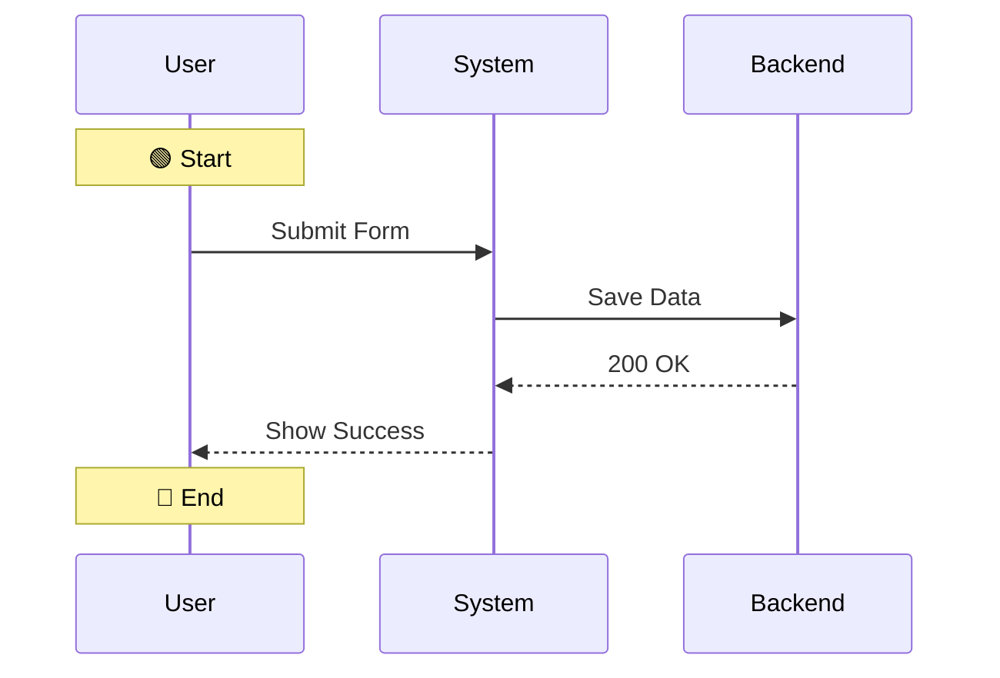
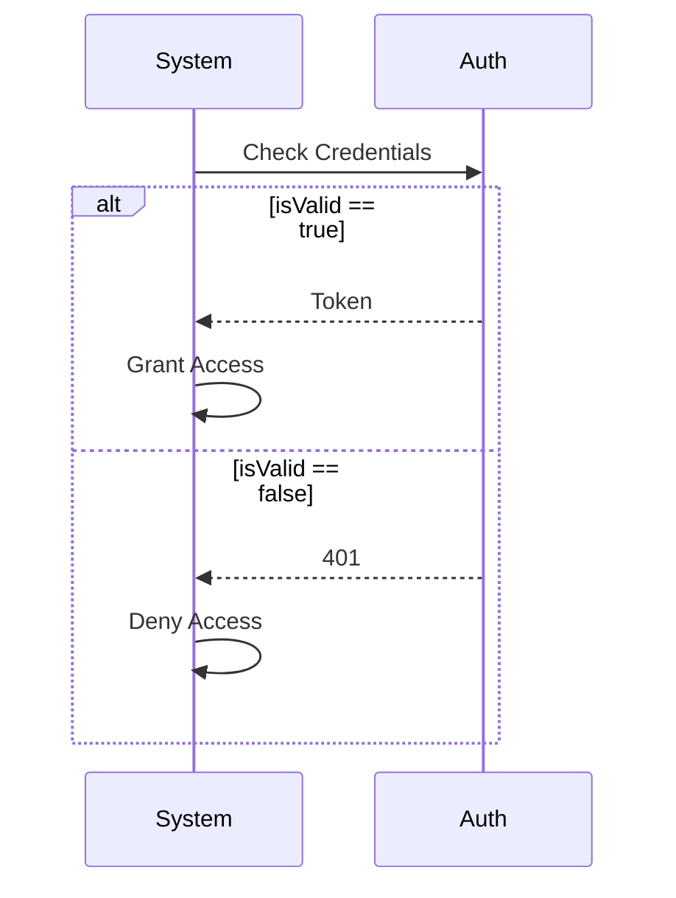
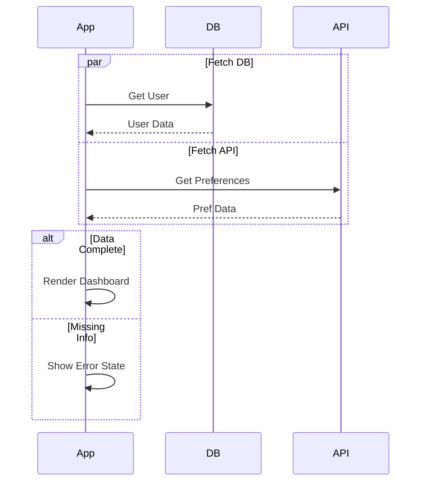

<!-- ==========================================================================
  bpmn_to_sequence_mapping.md — BPMN to Mermaid Sequence Mapping Rules
  Version: 1.0.0 | Date: 2026-09-09
  Original Author: Bala Madhusoodhanan | Enhanced By: Antigravity AI (Peer Coding)
  Changelog:
    1.0.0 (2026-09-09) - Created by Antigravity during peer coding enhancement.
========================================================================== -->

# BPMN to Sequence Mapping

This document provides a detailed mapping from BPMN 2.0 visual elements to Mermaid sequence diagram constructs.

## Participant Mapping

| BPMN Element | Mermaid Construct |
|---|---|
| Pool | `box [color] [Pool Name] ... end` group OR top-level `participant` |
| Lane | `participant <lane_id> as <Lane Name>` |
| Single-pool with lanes | Each lane → separate participant |
| Multi-pool | Each pool → `box` group, lanes within → participants |

## Activity Mapping

| BPMN | Mermaid |
|---|---|
| Task crossing lanes | `LaneA->>LaneB: Task Name` |
| Task within same lane | `Lane->>Lane: Task Name` (self-call) |
| User Task | `actor->>system: action` |
| Service Task | `system->>system: action` or `system->>backend: action` |
| Sub-Process | `rect rgb(200,220,255)` block |
| Loop Task | `loop Condition` block |

## Gateway Mapping (Detailed)

- **XOR (Exclusive)** → Translated to `alt/else/end` blocks. The outgoing sequence flows from the gateway become the conditions for the `alt` and `else` branches.
- **AND (Parallel Fork)** → Translated to `par/and/end` blocks. Each outgoing path is a branch in the `par`.
- **AND (Parallel Join)** → Represents the closing `end` of a `par` block, indicating all parallel branches merge and must complete before continuing.
- **OR (Inclusive)** → Can be represented as multiple independent `opt` blocks or a `par` block where conditions are evaluated.
- **Event-Based** → `alt` block where the conditions are the occurring events.

## Event Mapping

- **Start Event** → `Note over participant: 🟢 Start: label`
- **End Event** → `Note over participant: 🔴 End: label`
- **Timer Intermediate** → `Note over participant: ⏱ Wait: label`
- **Message Intermediate (catch)** → Incoming message arrow (`A-)B: msg`).
- **Message Intermediate (throw)** → Outgoing message arrow (`A-)B: msg`).
- **Error Boundary** → `break Error Condition` block.

## Flow Mapping

- **Sequence Flow (same lane)** → Handled via vertical progression (often self-call arrows or just Notes).
- **Sequence Flow (cross-lane)** → `A->>B: label` (solid arrow).
- **Message Flow (cross-pool)** → `A-)B: label` (async solid open arrow).
- **Conditional Flow** → The edge label dictates the `alt/else` condition.

## Graph Traversal Algorithm

To convert a BPMN node-edge graph into a linear sequence script, a structured traversal is required:
1. **Start at the Start Event.**
2. **Follow Sequence Flows** using DFS or BFS.
3. **At Fork Gateways:**
   - Push a new block context (e.g., `alt` or `par`).
   - Recursively process each outgoing branch.
4. **At Join Gateways:**
   - Pop the context. Stop processing the current branch (it merges). Wait for all branches to reach the join before proceeding past the join.
5. **Detect Back-Edges:** Keep track of visited nodes to detect loops. Render them using Mermaid's `loop`.
6. **Handle Unstructured Graphs:** Linearize chaotic models into readable traces using block scoping and early breaks.

## Examples

### 1. Simple Linear Process

### 2. Process with Exclusive Gateway

### 3. Process with Parallel & Exclusive Gateways

