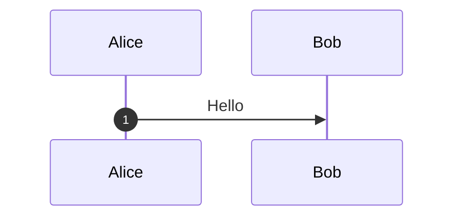
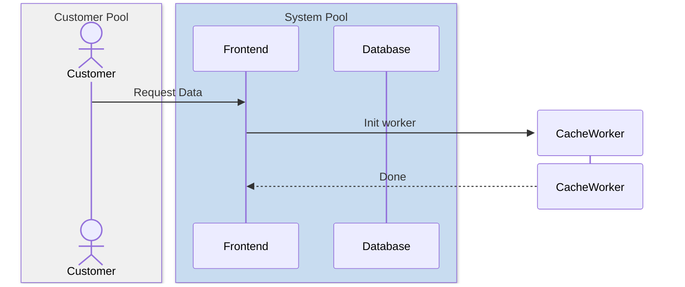
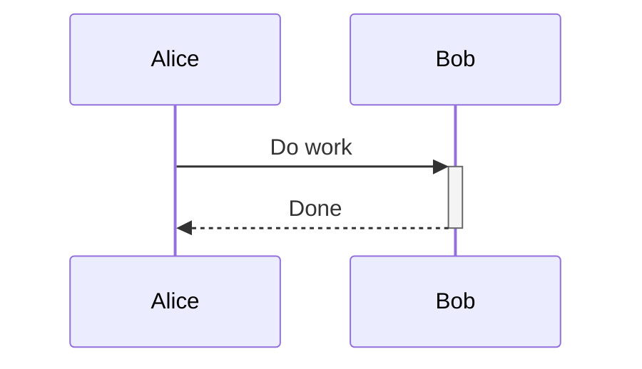
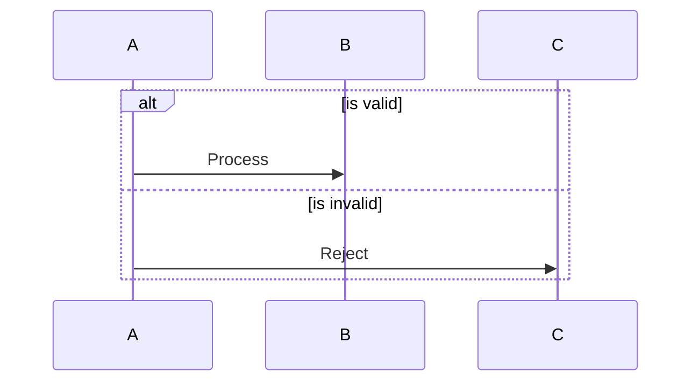
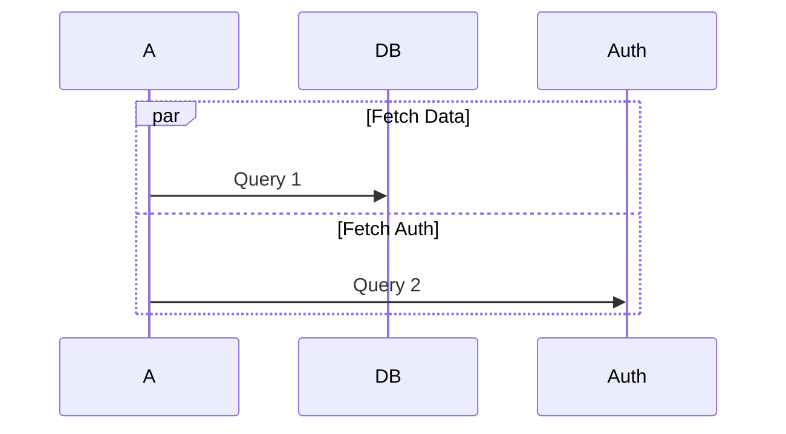
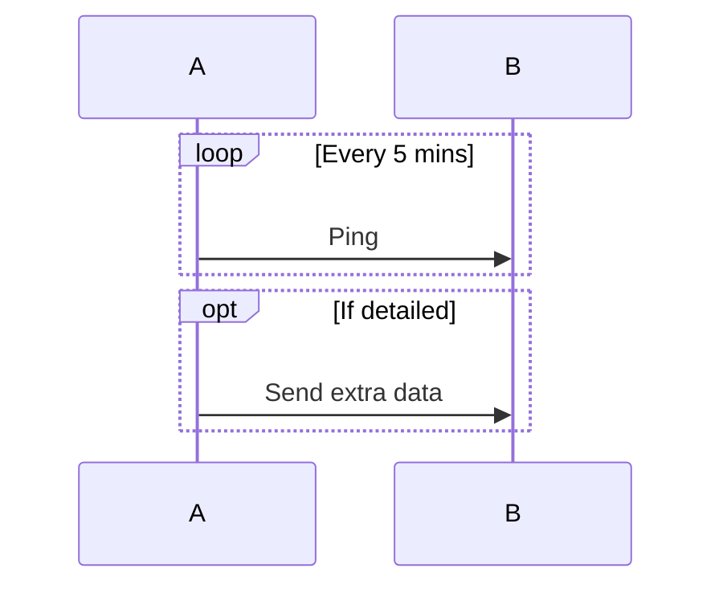
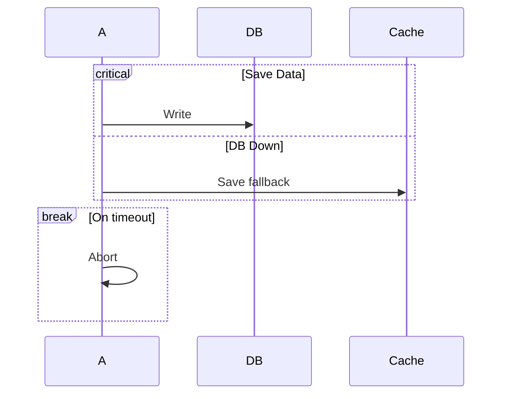
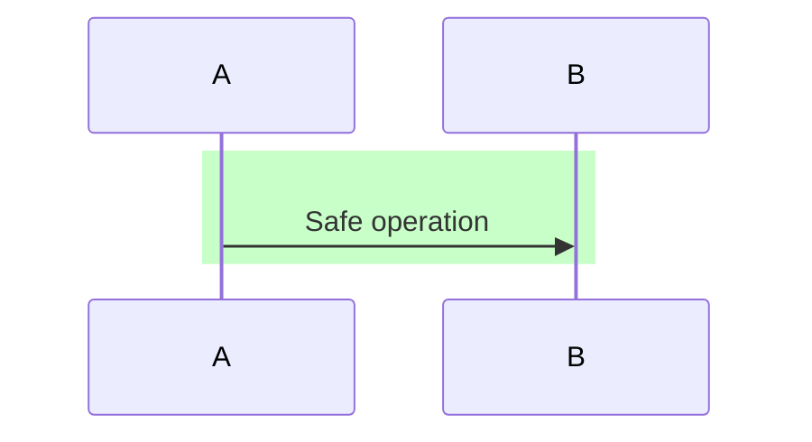

<!-- ==========================================================================
  mermaid_syntax.md — Mermaid Sequence Diagram Syntax Reference
  Version: 1.0.0 | Date: 2026-09-09
  Original Author: Bala Madhusoodhanan | Enhanced By: Antigravity AI (Peer Coding)
  Changelog:
    1.0.0 (2026-09-09) - Created by Antigravity during peer coding enhancement.
========================================================================== -->

# Mermaid Sequence Diagram Syntax

## Overview
This document covers the syntax for Mermaid sequence diagrams, specifically tailored for translating BPMN processes.

## Diagram Declaration
Every sequence diagram begins with the `sequenceDiagram` declaration. 
Optionally, use `autonumber` to automatically number the message flows.

## Participants & Actors
Participants define the distinct entities (swimlanes/systems). They are displayed left-to-right in the order they are declared.

- **Standard Participant**: `participant <id> [as <alias>]`
- **Actor (stick figure)**: `actor <id> [as <alias>]`
- **Grouping (Pools)**: `box [color] [Title] ... end`

### Dynamic Lifelines
You can dynamically create and destroy participants mid-flow:
- `create participant <id>`
- `destroy <id>`

### Example

## Message Arrow Types

| Syntax | Description | BPMN Use |
|--------|-------------|----------|
| `A->>B: msg` | Solid line, solid arrowhead | Synchronous call / sequence flow crossing lanes |
| `A-->>B: msg` | Dashed line, open arrowhead | Response / reply |
| `A-)B: msg` | Solid line, open half-arrow | Async message flow (cross-pool) |
| `A--)B: msg` | Dashed line, open half-arrow | Async notification |
| `A-xB: msg` | Solid with cross | Lost message / error |
| `A--xB: msg` | Dashed with cross | Failed return |

## Activations
Show when a participant is actively processing a task.
- Explicit: `activate <participant>` / `deactivate <participant>`
- Shorthand: Append `+` to the arrow to activate, and `-` to deactivate.

## Control Flow Blocks
Used to represent BPMN Gateways and Loops.

### XOR Gateway (Exclusive)

### AND Gateway (Parallel)

### Loop & Optional

### Error / Break

## Notes
Add context to the diagram.
- `Note left of <participant>: text`
- `Note right of <participant>: text`
- `Note over <participant>: text`
- `Note over <p1>,<p2>: text`

## Styling
Highlight areas with background colors.
- `rect rgb(r,g,b)` ... `end`
- `rect rgba(r,g,b,a)` ... `end`

