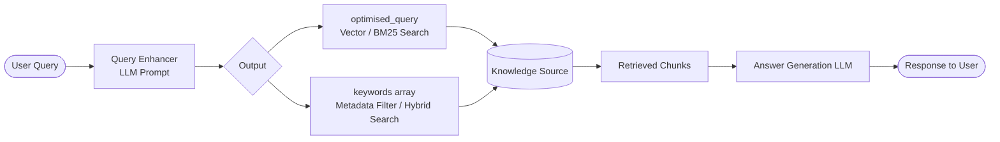
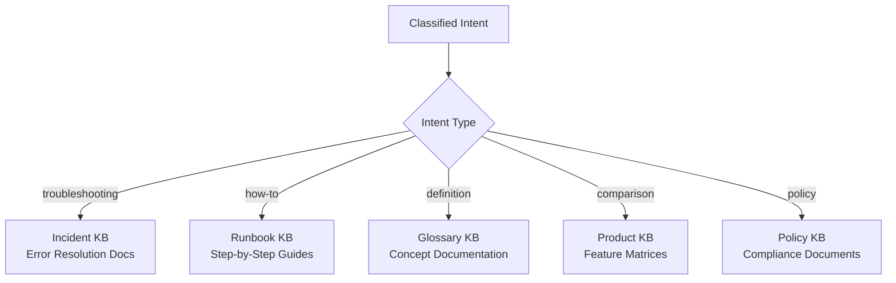

# 🔍 Skill: Query Enhancer for RAG Pipelines

## What This Skill Does

The Query Enhancer is a **preprocessing layer** that sits between the user's raw input and a RAG pipeline. When triggered, you must transform the user's natural, conversational query into a structured, optimised search input.

**You will:**
1. Take the **raw user query**
2. Output an **optimised search query** — rewritten for maximum semantic match against vector/keyword search
3. Output a **keywords array** — 5–10 terms for filtering, metadata tagging, or hybrid search
4. Classify the **intent type** — for routing to the correct knowledge base

---

## LLM Prompt Template

Use the following prompt to enhance queries. Replace `{{USER_QUERY}}` with the actual user input.

### Base Prompt (Query + Keywords)

```text
## ROLE
You are a search query optimisation assistant for a RAG (Retrieval-Augmented Generation) system.

## TASK
Given a user's raw input query, your job is to:
1. Generate an **optimised search query** — rewritten for maximum semantic clarity and retrieval relevance.
   - Expand abbreviations, resolve ambiguity, use precise terminology.
   - Remove filler words, greetings, or conversational noise.
   - Focus on the core information need.

2. Extract **5–10 keywords or key phrases** — terms that best represent the topic, entities, and intent.
   - Include synonyms or alternate forms where relevant.
   - Prioritise specificity over generality.

## INPUT
User Query: {{USER_QUERY}}

## OUTPUT FORMAT (strict JSON)
{
  "optimised_query": "<rewritten search query>",
  "keywords": ["keyword1", "keyword2", "keyword3", "..."]
}

## RULES
- Output ONLY valid JSON. No preamble, no explanation.
- Do not answer the user's question — only enhance it for search.
- If the query is already clear, still normalise and enrich it.
```

### Extended Prompt (With Intent Classification)

Append the following to the `## TASK` section when intent routing is needed:

```text
3. Classify the **intent** of the query into one of the following categories:
   - troubleshooting  → user is trying to fix a problem
   - how-to           → user wants step-by-step instructions
   - definition       → user wants to understand a concept or term
   - comparison       → user is comparing options or features
   - policy           → user is asking about rules, compliance, or procedures
```

And use this output schema instead:

```json
{
  "optimised_query": "<rewritten search query>",
  "keywords": ["keyword1", "keyword2", "keyword3", "..."],
  "intent": "troubleshooting | how-to | definition | comparison | policy"
}
```

---

## Pipeline Architecture



---

## Examples

### Example 1 — Troubleshooting

**Raw query:**
```
how do i fix the thing when my account gets locked out
```

**Enhanced output:**
```json
{
  "optimised_query": "account lockout resolution steps user authentication failure",
  "keywords": [
    "account lockout",
    "locked out",
    "authentication failure",
    "password reset",
    "access denied",
    "user account",
    "login error",
    "unlock account"
  ],
  "intent": "troubleshooting"
}
```

### Example 2 — Policy

**Raw query:**
```
what is the refund policy
```

**Enhanced output:**
```json
{
  "optimised_query": "refund policy terms and conditions return request process",
  "keywords": [
    "refund policy",
    "return policy",
    "money back",
    "refund request",
    "cancellation",
    "terms and conditions"
  ],
  "intent": "policy"
}
```

### Example 3 — How-To

**Raw query:**
```
hey can you tell me how to set up the vpn thing on my laptop
```

**Enhanced output:**
```json
{
  "optimised_query": "VPN client installation and configuration steps laptop setup guide",
  "keywords": [
    "VPN setup",
    "VPN configuration",
    "VPN client",
    "laptop VPN",
    "remote access",
    "network connection",
    "VPN installation"
  ],
  "intent": "how-to"
}
```

### Example 4 — Comparison

**Raw query:**
```
what's the difference between teams and slack
```

**Enhanced output:**
```json
{
  "optimised_query": "Microsoft Teams vs Slack comparison features pricing collaboration tools",
  "keywords": [
    "Microsoft Teams",
    "Slack",
    "Teams vs Slack",
    "collaboration tools",
    "messaging platform",
    "comparison",
    "features",
    "pricing"
  ],
  "intent": "comparison"
}
```

### Example 5 — Definition

**Raw query:**
```
what does SSO mean
```

**Enhanced output:**
```json
{
  "optimised_query": "Single Sign-On SSO definition authentication mechanism centralised login",
  "keywords": [
    "SSO",
    "Single Sign-On",
    "authentication",
    "centralised login",
    "identity management",
    "access management"
  ],
  "intent": "definition"
}
```

---

## Intent Categories

| Intent | Description | Signal Words |
|--------|-------------|--------------|
| **troubleshooting** | User is trying to fix a problem | fix, broken, not working, error, issue, crash, fail, stuck, can't |
| **how-to** | User wants step-by-step instructions | how, steps, guide, set up, configure, install, create, enable |
| **definition** | User wants to understand a concept | what is, what does, define, explain, meaning of |
| **comparison** | User is comparing options or features | vs, versus, compare, better, faster, difference |
| **policy** | User is asking about rules or compliance | policy, rule, guideline, compliance, regulation, requirement |

### Intent Routing



---

## Configuration Recommendations

| Consideration     | Recommendation |
|-------------------|----------------|
| **Model**         | Use a fast, small model (e.g. GPT-4o-mini, Gemini Flash) — this is a utility call, not a reasoning one |
| **Temperature**   | Set to `0` for consistent, deterministic output |
| **Output Parsing**| Always parse as JSON; add a fallback if parsing fails |
| **Caching**       | Hash the raw query — cache results to avoid duplicate LLM calls |
| **Hybrid Search** | Feed `optimised_query` to your vector store; use `keywords` for BM25 or metadata filtering |

---

## Customisation

### Adding Custom Intent Categories

Add new categories to the intent list in the prompt template:

```text
   - onboarding      → user is a new employee asking about setup or orientation
   - escalation      → user needs to raise an issue to a higher authority
```

### Domain-Specific Terminology

Add a domain context section to the prompt for better query rewriting:

```text
## DOMAIN CONTEXT
This system serves an IT Service Desk. Common terminology includes:
- AD = Active Directory
- MFA = Multi-Factor Authentication
- VPN = Virtual Private Network
- SSO = Single Sign-On
```

---

## Important Notes

- This skill should run **before** any vector or keyword search call
- It is **stateless** — no memory of previous queries is required
- Keep latency low by using the smallest capable model available
- Always validate the JSON output before passing downstream; use a try/catch or schema validator

---

## Changelog

| Version | Date       | Notes               |
|---------|------------|---------------------|
| 1.0.0   | 2026-07-10 | Initial release     |
