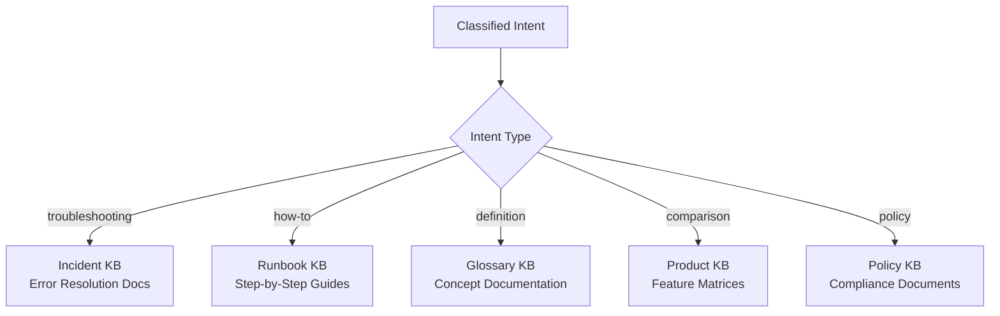

# Intent Categories Reference

> Classification taxonomy for routing user queries to the correct knowledge base or agent.

---

## Intent Categories

| Intent | Description | Example Queries |
|--------|-------------|-----------------|
| **troubleshooting** | User is trying to fix a problem or resolve an error | "my screen is frozen", "can't connect to wifi", "error 403 when logging in" |
| **how-to** | User wants step-by-step instructions to accomplish a task | "how do I reset my password", "steps to configure VPN", "how to submit a ticket" |
| **definition** | User wants to understand a concept, term, or feature | "what is MFA", "explain SSO", "what does this error code mean" |
| **comparison** | User is comparing options, features, or alternatives | "which VPN is faster", "Teams vs Slack", "compare Standard and Premium plans" |
| **policy** | User is asking about rules, compliance, or procedures | "what is the password policy", "remote work guidelines", "data retention rules" |

---

## Detection Signals

### Troubleshooting
- Error messages or codes mentioned
- Words: fix, broken, not working, error, issue, problem, crash, fail, stuck
- Negation patterns: "can't", "won't", "doesn't"

### How-To
- Question words: how, steps, guide, instructions, tutorial
- Action verbs: set up, configure, install, create, enable, disable

### Definition
- Question words: what is, what does, define, explain, meaning of
- Conceptual terms without action context

### Comparison
- Comparative words: vs, versus, compare, better, faster, cheaper, difference
- Multiple entities mentioned in the same query

### Policy
- Governance words: policy, rule, guideline, compliance, regulation, requirement
- Organisational context: company, team, department, manager approval

---

## Routing Logic



---

## Extending Intent Categories

To add a custom intent category:

1. **Define the category** with a clear name, description, and example queries
2. **Update the prompt** — add the category to the intent list in `references/prompt_template.md`
3. **Update the validator** — add the category to `QueryEnhancer.VALID_INTENTS` in the script
4. **Update routing** — add the new intent to your downstream routing logic

### Example: Adding "onboarding"

```python
# In query_enhancer.py
VALID_INTENTS = {
    "troubleshooting", "how-to", "definition",
    "comparison", "policy",
    "onboarding"  # ← new
}
```

| Intent | Description | Example Queries |
|--------|-------------|-----------------|
| **onboarding** | New user asking about setup, orientation, or getting started | "I'm new, how do I get access", "first day setup checklist", "where do I find the employee handbook" |
